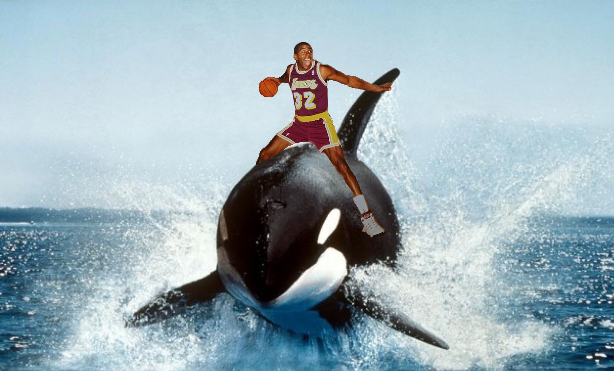

# THe PuMp Is H3R3!!!!!!!!!

The dump is coming.

## FAQ 

**Who Created PumpnDump?**

The Three Satoshis

**What in the World?** 

## Careers 

**Blockchain Developer**
* Compensation: Come Measure It (with experience) 
* ROLES & RESPONSIBILITIES:
    * Responsible for Blockchain evaluation, smart contract development, implementation
    * Must have 12+ years Solidity experience 
    * 15+ years experience setting up Blockchain nodes and networks.
    * Design and develop the architecture of Blockchain Solutions from a systemic standpoint.
    * Responsible for creating technical solution architecture for a given business problem.
    * Set the standards for design and development.
    * Design & implement Blockchain solutions which may run on Blockchain platforms and composed of multiple software packages based on Solution Architect.
    * Lead a team of Blockchain juniors. 
    * Can ride whales, must have 4chan account.
    * Work with product managers and other product teams.
    * Well versed in using GitHub.
    * Should be flexible to explore different blockchains be it Ethereum, Ripple, Tron, AVA, Multichain, etc.
    * Experience in PHP, Visual Basic, Java a must.
