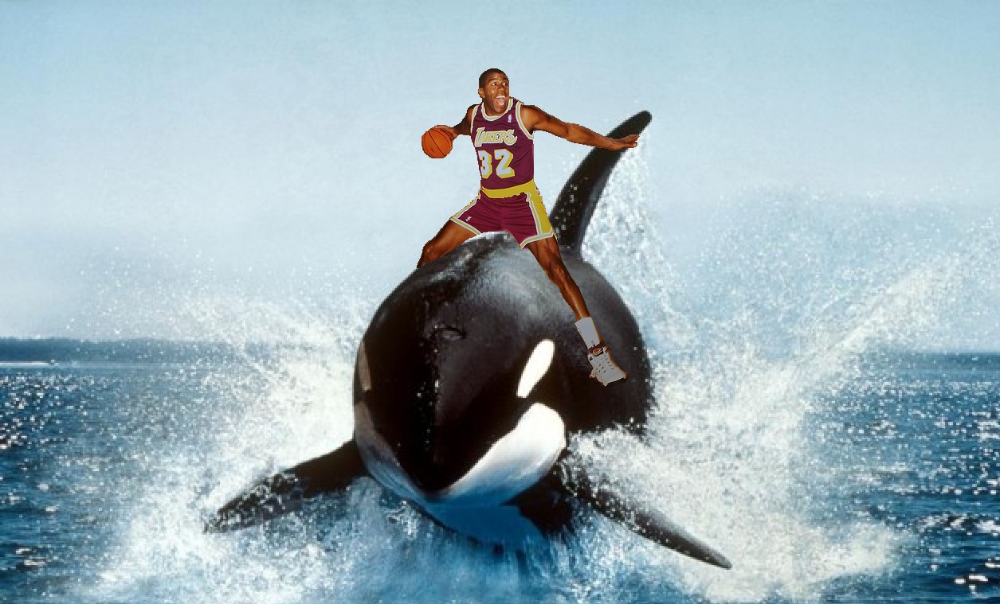
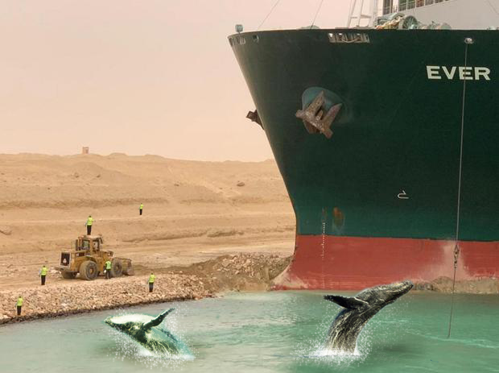
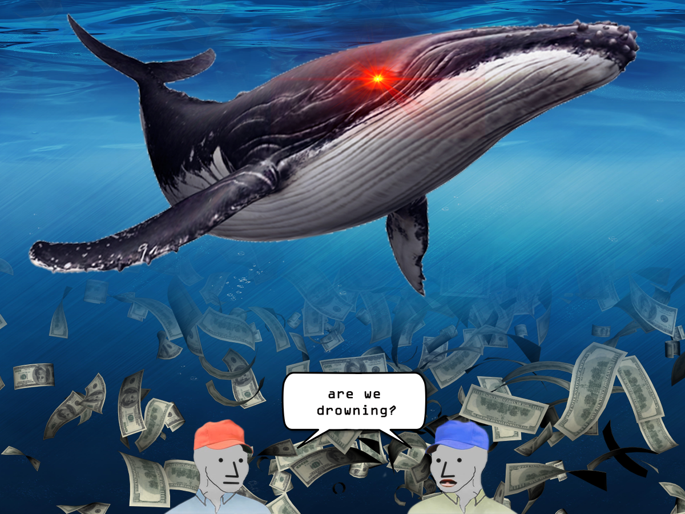
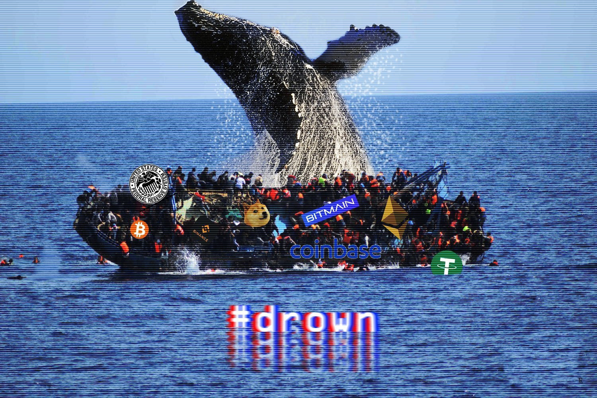
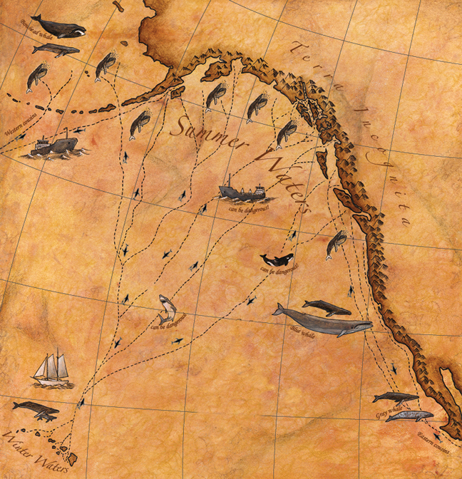
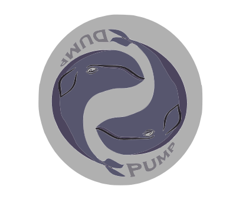

# THe PuMp Is H3R3!!!!!!!!!

Address of the PumP (pNd): 👛 0xB869599Fd38f076A690369760B8815F67C4e2075

symbol of the Pump: 🐋 pNd

The dump is coming.

But don't take our word for it: 

> "Life has become immeasurably better since I have been forced to stop taking it seriously. Pump&Dump"  - WhaleHunter S. Thompson

> "pNd is the most fun I have had in Crypto since MtGox!" - Moby Dickens author of *A Whale of Two Cities* 

> "I may be crazy, but the pNd keeps me from going insane" - Whaleon Jennings

> "If you give a person a fish, they'll fish for a day. But if you train a person to fish, they'll pump and dump for a lifetime." - Dan Qwhale

> "pNd is a real coin in a fake world" - Wale

> "“Dreams have only one owner at a time. That's why dreamers hodl pNd.” - Whaleyum Faulker 

> "Ride the Whale...It's Magic" - David [Blainville](https://en.wikipedia.org/wiki/Blainville%27s_beaked_whale), street magician 

<video width="320" height="240" controls>
  <source src="pnd.mp4" type="video/mp4">
</video>

 

## FAQ 

### Who Created pumpNdump?

The Three Satoshis

### What in the World? 

### Your beliefs don't seem credible - Who Are Some Famous Followers of the Satoshi?

Some Profits of the Three Satoshis include:
* **heyZeus Cryto** - will return after these messages 
* **Whaley Dhama**- "Radicalism is compassion" 
* **Whalestrodamus** - "The dump is coming...will you pump?" 
* **Whalemond Kurzwieil** - "The dumpularity is near"
* **Whale F. Kennedy** - "It's not about what the dump can do you for...it's about what you can do for the pump" 

### How Do I Help Bring About The Dump?

Health Rituals for bringing about the dumpening:
* **Juice Cleansing** - Buy inorganic fruits and vegetables from the market. Wash items for 2-4 hours until they turn into clumpy juice. Throw away without consuming and begin again. Repeat 4 times daily.
* **Fasting** - Go to pharmacy - preferable one with self checkout. Get on longest service line available and complain about speed of checkout. Demand to know why the line is not moving faster. Attempt to engage with customers in front of you. 

<video width="320" height="240" controls>
  <source src="fruit.MOV" type="video/mp4">
</video>

## Projects that will bring about the dumpening:

[Council for Inclusive Capitalism w/ the Vatican](https://www.inclusivecapitalism.com/) The Pope + Visa are finally teaming up with SalesForce and all the other Avengers to fix Captialism once and for all!!!!!!

^^^^^^

[one day speculator will buy all the air](https://cheapeth.org/)

[not to breathe, only for hodl](https://cheapeth.org/)

but we don't care

because we stole ocean

from stupid whales and dolphin nose bottle

### What Was The Recent "Fat Earth" Controversy All About?

While we do believe that our home planet has put on too much weight, we are offended by claims our critics are making that we are "Fat Earthers." We prefer more planet positve and appropriate names for our stance - such as "Hour Glass Earthers" or "Earth+" 

## Careers 

**Blockchain Developer**
* Compensation: Come Measure It (with experience) 
* ROLES & RESPONSIBILITIES:
    * Responsible for Blockchain evaluation, smart contract development, implementation
    * Must have 12+ years Solidity experience 
    * 15+ years experience setting up Blockchain nodes and networks.
    * Design and develop the architecture of Blockchain Solutions from a systemic standpoint.
    * Responsible for creating technical solution architecture for a given business problem.
    * Set the standards for design and development.
    * Design & implement Blockchain solutions which may run on Blockchain platforms and composed of multiple software packages based on Solution Architect.
    * Lead a team of Blockchain juniors. 
    * Can ride whales, must have 4chan account.
    * Work with product managers and other product teams.
    * Well versed in using GitHub.
    * Should be flexible to explore different blockchains be it Ethereum, Ripple, Tron, AVA, Multichain, etc.
    * Experience in PHP, Visual Basic, Java a must.

[Contact Us](https://www.reddit.com/r/crypto/)

## FIN

c'est ne pas coin 

